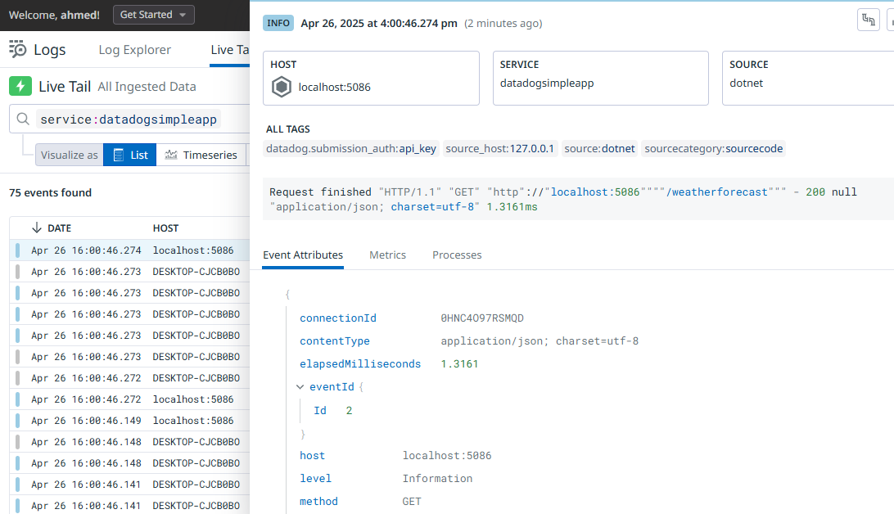
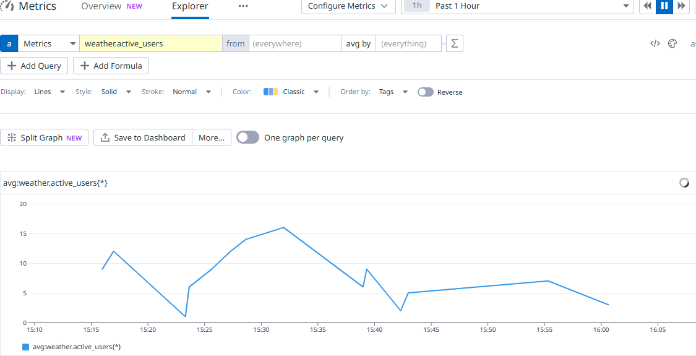

# 🎯 Goal:
- Small ASP.NET Core Web API app
- Running **locally on Windows**
- Integrated with **Datadog Agent installed on Windows**
- Sending **logs**, **custom metrics**, **traces** to Datadog


# How It Works
### 1. Logging
Serilog sends logs over TCP to 127.0.0.1:5087.

Example log: "Page refreshed - weather data requested".

### 2. Metrics
DogStatsD sends custom metrics to Datadog agent on port 8125 (UDP):

Metric weather.forecast.requests increments with each API call.

Metric weather.active_users gauges the number of users hitting the endpoint.

### 3. Tracing
Datadog.Trace creates a span every time /weatherforecast is called:

Span name: simple.test.trace

Tag added: test.tag = simple_trace.

These traces automatically go to the Datadog Agent on port 8126.

### 4. App

https://localhost:5086/weatherforecast

#### Every time you refresh:

- A log entry is sent to Datadog.

- A metric is updated in Datadog.

- A trace span is created in Datadog APM.


--- 

### How to View Data in Datadog UI
#### Logs:

- Go to Logs section.

- Filter by source:dotnet or by your Service name (e.g., datadogsimpleapp).



#### Metrics:

- Go to Metrics Explorer.

- Search for:

- weather.forecast.requests

- weather.active_users



#### Traces:

- Go to APM > Traces.

- Find spans with name simple.test.trace.

- You can filter by service name too (datadogsimpleapp).


---

# 🛠 Step 1: Create a New Web API Project

In CMD or PowerShell:

```bash
dotnet new webapi -n DatadogSimpleApp
cd DatadogSimpleApp
```

✅ This will create a folder `DatadogSimpleApp` with a basic Web API project inside.

---

# 🛠 Step 2: Install Datadog NuGet Packages

Still inside the project folder:

```bash
dotnet add package Serilog
dotnet add package Serilog.Sinks.Network
dotnet add package Datadog.Trace
dotnet add package StatsdClient
```

✅ This installs the Datadog tracer package.

---

# 🛠 Step 3: Add Simple Code for Tracing, Logs and Custom Metrics
You can integrate Datadog **inside your `MapGet()`** directly like this:

```csharp
using Datadog.Trace;
using Serilog;
using Serilog.Sinks.Network;
using StatsdClient;

var builder = WebApplication.CreateBuilder(args);

// Configure Serilog
Log.Logger = new LoggerConfiguration()
    .MinimumLevel.Debug()
    .WriteTo.TCPSink("tcp://127.0.0.1:5086")  // <-- IP and Port of your Datadog agent
    .CreateLogger();

// Make sure ASP.NET Core uses Serilog
builder.Host.UseSerilog();    

// Add services to the container
builder.Services.AddOpenApi();

// Configure StatsD (Datadog metrics)
var dogstatsdConfig = new StatsdConfig
{
    StatsdServerName = "127.0.0.1", // Datadog Agent address
    StatsdPort = 8125,
};

using var dogStatsdService = new DogStatsdService();
if (!dogStatsdService.Configure(dogstatsdConfig))
{
    throw new InvalidOperationException("Cannot initialize DogStatsD.");
}

var app = builder.Build();

// Configure the HTTP request pipeline
if (app.Environment.IsDevelopment())
{
    app.MapOpenApi();
}

app.UseHttpsRedirection();

var summaries = new[] 
{
    "Freezing", "Bracing", "Chilly", "Cool", "Mild", "Warm", "Balmy", "Hot", "Sweltering", "Scorching"
};

int activeUsers = 0; // Track active users

// Track the number of requests to the weather forecast endpoint
app.MapGet("/weatherforecast", () =>
{
    Log.Information("Page refreshed - weather data requested");

    // Increment the request count metric
    dogStatsdService.Increment("weather.forecast.requests");

    // Track active users - custom metric
    activeUsers++;
    dogStatsdService.Gauge("weather.active_users", activeUsers);

    using (var scope = Tracer.Instance.StartActive("custom.weather_api_call"))
    {
        scope.Span.SetTag("custom.tag", "weatherforecast");

        var forecast = Enumerable.Range(1, 5).Select(index =>
            new WeatherForecast
            (
                DateOnly.FromDateTime(DateTime.Now.AddDays(index)),
                Random.Shared.Next(-20, 55),
                summaries[Random.Shared.Next(summaries.Length)]
            ))
            .ToArray();
        return forecast;
    }
})
.WithName("GetWeatherForecast");

app.Run();

record WeatherForecast(DateOnly Date, int TemperatureC, string? Summary)
{
    public int TemperatureF => 32 + (int)(TemperatureC / 0.5556);
}

```


---

# 🛠 Step 4: Set Environment Variables for Datadog

Before running the app, **open CMD**, and set these variables:

```bash
set DD_AGENT_HOST=localhost
set DD_ENV=development
set DD_SERVICE=datadog-simpleapp
set DD_VERSION=1.0.0
set DD_TRACE_DEBUG=true
```

✅ These tell the app how to communicate with the Datadog Agent.

If you want them always available, you can add them in **system environment variables** later.

---

# 🛠 Step 5: Enable Datadog Agent on Windows

Make sure:
- Datadog Agent is **installed** and **running**.
- In `datadog.yaml`, set:
  ```yaml
  logs_enabled: true
  dogstatsd_port: 8125
  apm_config: 
	  enabled: true
  ```
- Restart the Datadog Agent service after changes.
- In `datadog\conf.d\custom_app.d\conf.yaml` set:
```yaml
logs:
  - type: tcp
    port: 5087
    service: datadogsimpleapp
    source: dotnet
    sourcecategory: sourcecode

```

- In `datadog\conf.d\tcp_check.d\conf.yaml`, set:
```yaml
## All options defined here are available to all instances.
#
init_config:

    ## @param service - string - optional
    ## Attach the tag `service:<SERVICE>` to every metric, event, and service check emitted by this integration.
    ##
    ## Additionally, this sets the default `service` for every log source.
    #
    # service: <SERVICE>

## Every instance is scheduled independently of the others.
#
instances:

    ## @param name - string - required
    ## Name to assign to your TCP check instance.
    #
  - name: "check my app"

    ## @param host - string - required
    ## Host to connect to.
    #
    host: "localhost"

    ## @param port - integer - required
    ## Port of the host to connect to.
    #
    port: 5087

    ## @param timeout - number - optional - default: 10
    ## Timeout of the TCP query in second.
    #
    # timeout: 10

    ## @param collect_response_time - boolean - optional - default: false
    ## The `collect_response_time` parameter instructs the check to create a
    ## metric 'network.tcp.response_time', tagged with the host name,
    ## reporting the response time in seconds.
    #
    # collect_response_time: false

    ## @param ip_cache_duration - number - optional
    ## Time in seconds to cache the IP address of the given host. If duration is not set,
    ## the cache will expire only upon error.
    ##
    ## Set ip_cache_duration to `0` if the check should resolve the IP address on every check run.
    #
    # ip_cache_duration: 120

    ## @param multiple_ips - boolean - optional - default: false
    ## Enable to run the check against all IPs attached to `host`.
    #
    # multiple_ips: false

    ## @param ipv4_only - boolean - optional - default: false
    ## Enable to run the check against only IPv4-formatted addresses on every check run.
    #
    # ipv4_only: false

    ## @param tags - list of strings - optional
    ## A list of tags to attach to every metric and service check emitted by this instance.
    ##
    ## Learn more about tagging at https://docs.datadoghq.com/tagging
    #
    # tags:
    #   - <KEY_1>:<VALUE_1>
    #   - <KEY_2>:<VALUE_2>

    ## @param service - string - optional
    ## Attach the tag `service:<SERVICE>` to every metric, event, and service check emitted by this integration.
    ##
    ## Overrides any `service` defined in the `init_config` section.
    #
    # service: <SERVICE>

    ## @param min_collection_interval - number - optional - default: 15
    ## This changes the collection interval of the check. For more information, see:
    ## https://docs.datadoghq.com/developers/write_agent_check/#collection-interval
    #
    # min_collection_interval: 15

    ## @param empty_default_hostname - boolean - optional - default: false
    ## This forces the check to send metrics with no hostname.
    ##
    ## This is useful for cluster-level checks.
    #
    # empty_default_hostname: false

    ## @param metric_patterns - mapping - optional
    ## A mapping of metrics to include or exclude, with each entry being a regular expression.
    ##
    ## Metrics defined in `exclude` will take precedence in case of overlap.
    #
    # metric_patterns:
    #   include:
    #   - <INCLUDE_REGEX>
    #   exclude:
    #   - <EXCLUDE_REGEX>

```

---

# 🛠 Step 6: Run the app!

Now, in the CMD (same window where you set the vars):

```bash
dotnet run
```

✅ Your app will run on `http://localhost:5086`.

Try visiting:
```
http://localhost:5086/weatherforecast
```

You should see random weather data.

✅ And behind the scenes:
- A **trace** is sent to Datadog.
- A **custom tag** is attached.
- Logs should also be collected.

---

# 🧠 You Now Have:

| Feature | Status |
|:---|:---|
| Web API App | ✅ |
| Datadog Tracing | ✅ |
| Custom Metrics (via tags) | ✅ |
| Log Collection | ✅ (after logs config) |
| Environment & Service Tags | ✅ |


---

# 📋 Very Short Summary of the Plan:

| Action | Description |
|:---|:---|
| Create .NET API | `dotnet new webapi` |
| Add Datadog.Trace | `dotnet add package Datadog.Trace` |
| Set Env Vars | `set DD_...` |
| Run App | `dotnet run` |
| Install + Configure Agent | Windows Datadog Agent |

---


