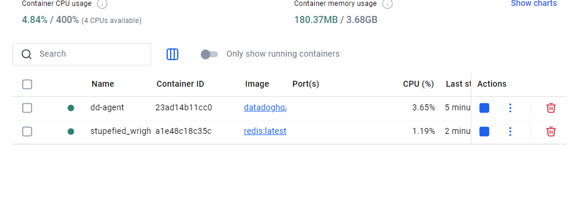
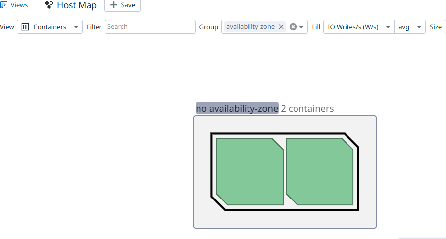
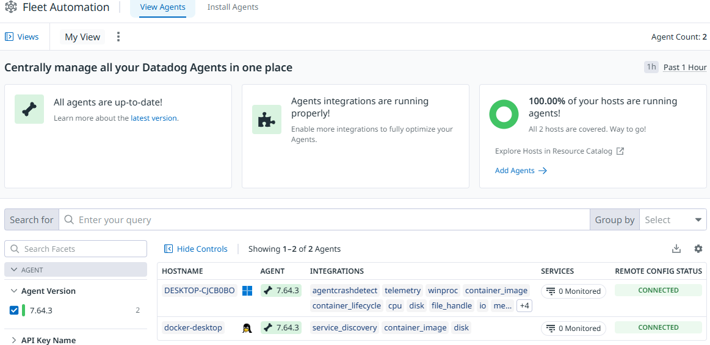

Datadog Integration with Docker Desktop
This documentation describes the process for integrating Datadog with a Docker environment, including setting up Redis and Datadog Agent services using Docker Desktop.

## Step 1: Sign Up for Datadog
Go to the Datadog Sign Up page.
Complete the sign-up process by entering your details.
Once signed up, log in to your Datadog account.
Datadog site will provide you with the api key

## Step 2: Install Docker and run the docker desktop
Open your terminal.

Use the following commands to install the agent:

```
docker run -d --name dd-agent -e DD_API_KEY=58d7a19cac7fc565ac2ecd1f7c44c102 -e DD_SITE="datadoghq.eu" -e DD_DOGSTATSD_NON_LOCAL_TRAFFIC=true -v /var/run/docker.sock:/var/run/docker.sock:ro -v /proc/:/host/proc/:ro -v /sys/fs/cgroup/:/host/sys/fs/cgroup:ro -v /var/lib/docker/containers:/var/lib/docker/containers:ro gcr.io/datadoghq/agent:7
```


## Step 4: Start the Services with Docker Desktop:

to see if the images are up and running it should give you a output like that

Docker output image




## Step 5: Check DataDog WebSite
sign in to the used datadog account through the website

navigate to infrastructure

navigate to containers

you should see 2 containers 1-datadog agent 2-mysql container



also you can view the installed agents to check:

