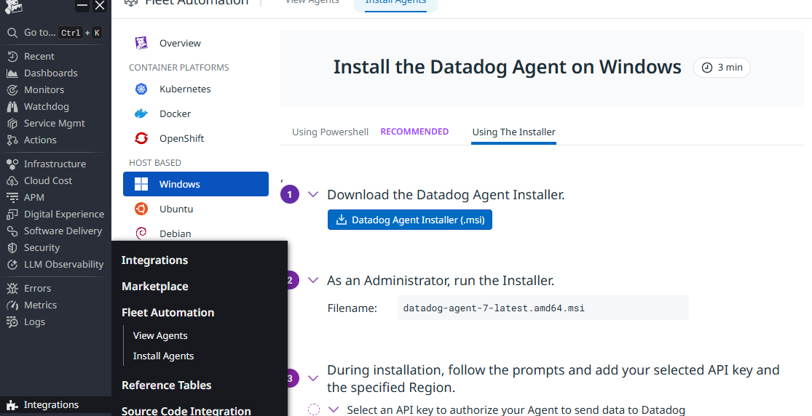
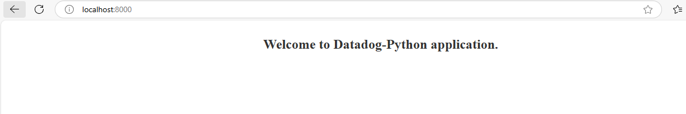
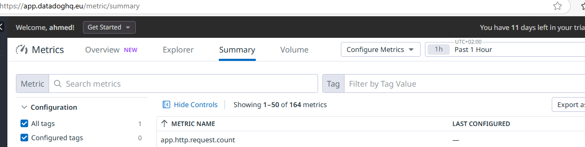
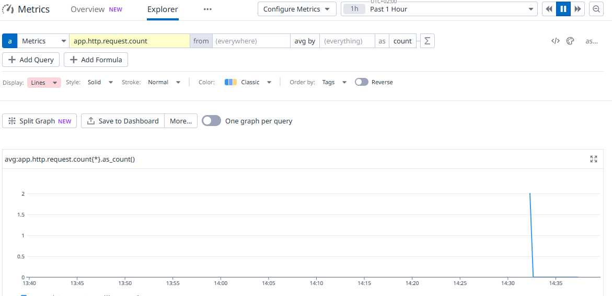

This documentation describes the process for installing datadog agent in windows.

## Step 1: Sign Up for Datadog
- Go to the [Datadog Sign Up page](https://www.datadoghq.com/).
- Complete the sign-up process by entering your details.
- Once signed up, log in to your Datadog account.
- Datadog site will provide you with the api key


## Step 2: Install datadog agent

Go to Integrations -> install agents -> select the agent you want installed then follow the steps.




## Step 3: Creating a Custom metic with simple python web application:

```
import http.server
from datadog import initialize, statsd
#Port in which the web app runs
APP_PORT = 8000
#host and port in which the datadog listen to
options = {'statsd_host':'localhost',
           'statsd_port':8125}

class HandleRequests(http.server.BaseHTTPRequestHandler):

    def do_GET(self):
#the name, rate, type and tags of the metric
        statsd.increment('app.http.request.count', sample_rate=1, tags =["env:dev" ,"app:pythonapp"])
        self.send_response(200)
        self.send_header("Content-type", "text/html")
        self.end_headers()
        self.wfile.write(bytes("<html><head><title>First Application</title></head><body style='color: #333; margin-top: 30px;'><center><h2>Welcome to Datadog-Python application.</center></h2></body></html>", "utf-8"))

if __name__ == "__main__":
#Initializing the options of the host and port of datadog
    initialize(**options)
    server = http.server.HTTPServer(('localhost', APP_PORT), HandleRequests)
    server.serve_forever()

```





**filter by tags**

**then select the metrics you want to preview.**






