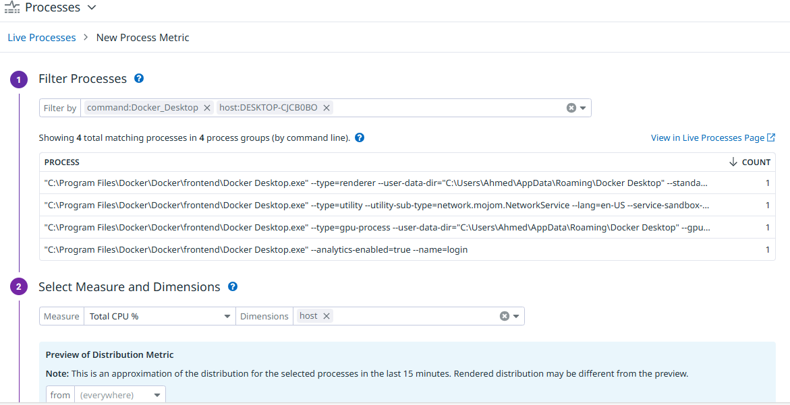

This documentation describes the process for installing datadog agent in windows.

## Step 1: Sign Up for Datadog
- Go to the [Datadog Sign Up page](https://www.datadoghq.com/).
- Complete the sign-up process by entering your details.
- Once signed up, log in to your Datadog account.
- Datadog site will provide you with the api key

## Step 2: Install datadog agent

Go to Integrations -> install agents -> select the agent you want installed then follow the steps.

## Step 3: Creating a Custom metic

**enable the process explorer in datadog.**

**create a new metric for any process.**

**filter by command:process**

**then select the metrics you want to preview.**

